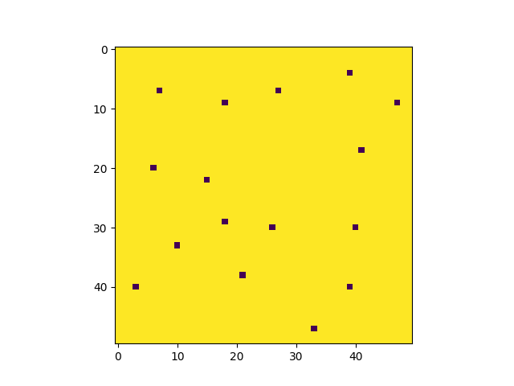
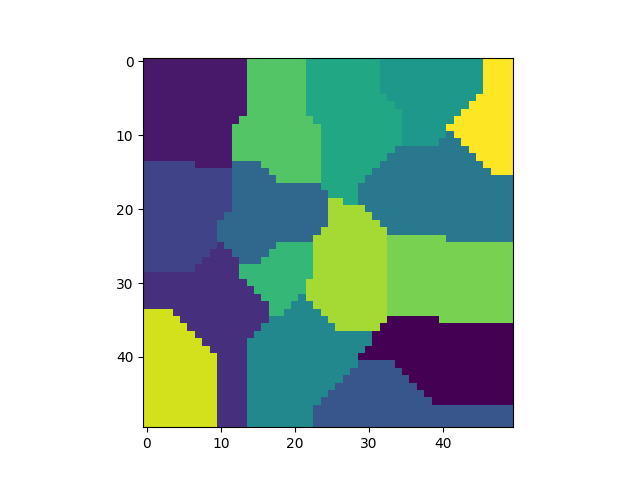
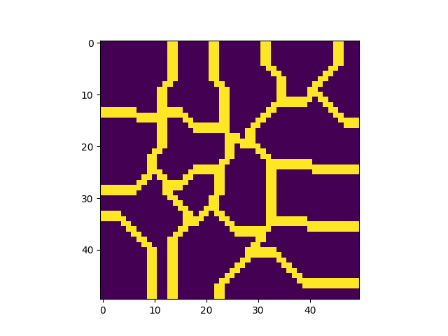
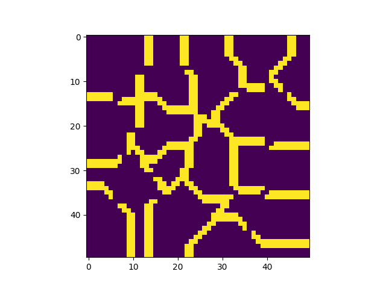

# Voronoi Dungeon Generation Algorithm

This repository provides dungeon generation algorithm using voronoi diagram.

# Generation Steps and examples

## Step 1

Randomly set points which have some distance from each other and from walls.

## Step 2

Find the nearest randomly selected point using Manhattan distance for the entire pixel and add the pixel to that point’s room.

## Step 3

Empty the pixel with same distance from multiple points for making wall.

## Step 4

Find set of neighbors, and randomly select one of them. Connect two rooms and append the rooms to the group. Until group has every member of the rooms, select new path from set of neighbors which contains at least one member from group. If a path is selected, append new rooms to the group.

